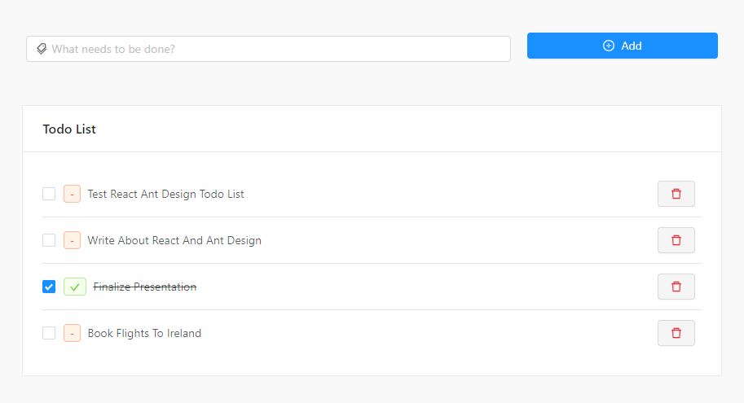

# React-todo-list



React Todo List — это простое приложение для управления задачами (to-do list), построенное на базе React с использованием компонентов и контекста для управления состоянием.

### Функциональность
  Добавление задач: Пользователи могут добавлять новые задачи в список.
  Просмотр списка задач: Все задачи отображаются в виде списка.
  Редактирование задач: Пользователи могут редактировать названия задач.
  Удаление задач: Задачи можно удалять из списка.
  Изменение статуса выполнения: Задачи могут быть отмечены как выполненные, и выполненные задачи отображаются зачёркнутыми.
  Технологии
  
### Frontend:
  React для построения пользовательского интерфейса.
  Ant Design для стилизации компонентов.
  Context API для управления состоянием.
  Установка и настройка
  Чтобы запустить проект локально, выполните следующие шаги:

1. Клонирование репозитория
```bash
git clone https://github.com/David-Mikava/react-todo-list.git
cd react-todo-list
```
2. Установка зависимостей
```bash
npm install
```
3. Запуск приложения
```bash
npm run dev
```
